# Gaming with friends and chatting and accounting

An implementation of microservices

- [Introduction](##introduction)
- [Description](#description)
- [Requirements](#requirements)
- [Installation](#installation)
- [Running Dev](#running-dev)
- [Glossary](#glossary)

## Introduction

Tic-Tac-Toe gaming with your friends adn other players over network which you can send/accept friend request to others and play with your friends in lobby or any other player.

You can view your game history(wins,losses,draws, each game log)

## Description
- Accounting backend
  - Responsibilities :
    - AAA : Authentication, Authorization, Accounting
    - Friend List and requests
  - Dev stack : PHP, Laravel, mysql
  - over Http
- Gaming and Chatting 
  - Responsibilities : 
    - Chatting over websocket
    - Chat history
    - Playing Tic-Tac-Toe over web socket
    - Game Lobby using web socket
  - Dev stack : NodeJs, Fastify, MongoDB
  - Chatting and Gaming is over websockets
- Front end : 
  - Dev stack : Tailwind, Solid js, Flowbite
  - Front end is served by Vite


---------------------------------

## Requirements
- php
- mysql
- mongodb
- node


**You can run all services in a single machine on different ports**
- On windows, xampp, mongodb and node is all you need because those include
- On Linux you need mysql and mongodb installed and apache or nginx as your php web server(You can expose laravel only with php artisan serve command) and node
- Docker


## Installation
```bash
 cd Accounting && composer install && php artisan migrate
```
```bash
 cd Flowbite-Solid && npm i 
```
```bash
 cd Gaming-Chatting && npm i 
```
---------------------------------

## Running dev
**you can start browsing by http://localhost:4000**

also when you are serving each microservice, you can see their port and url when starting them

```bash
 cd Accounting && php artisan serve
```
```bash
 cd Flowbite-Solid && npm run dev 
```
```bash
 cd Gaming-Chatting && npm npm run dev  
```

---------------------------------

## Glossary


#### Microservices
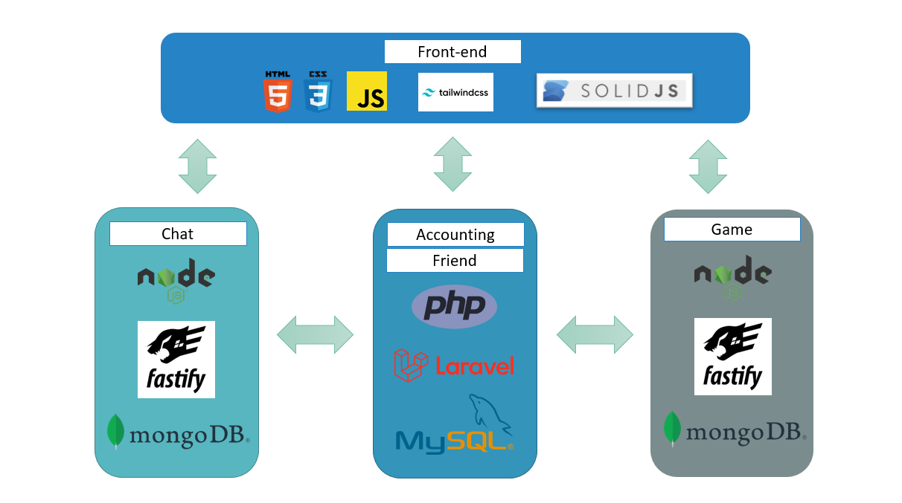

---------------------------------

#### Connections
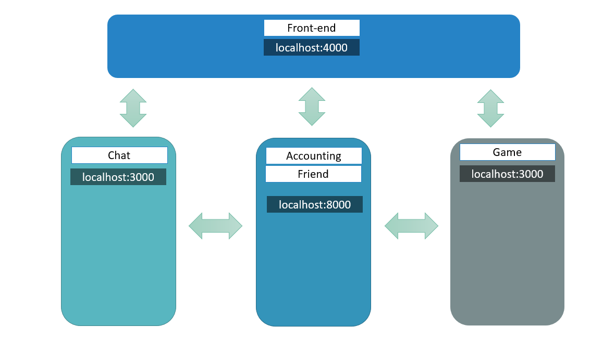

---------------------------------

#### Responsibilities
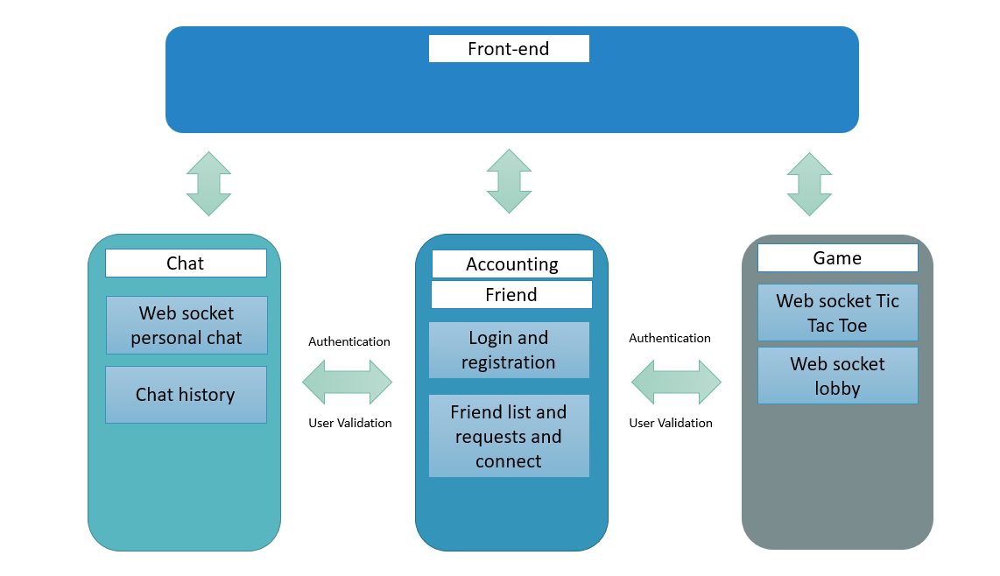

---------------------------------

#### Deployment
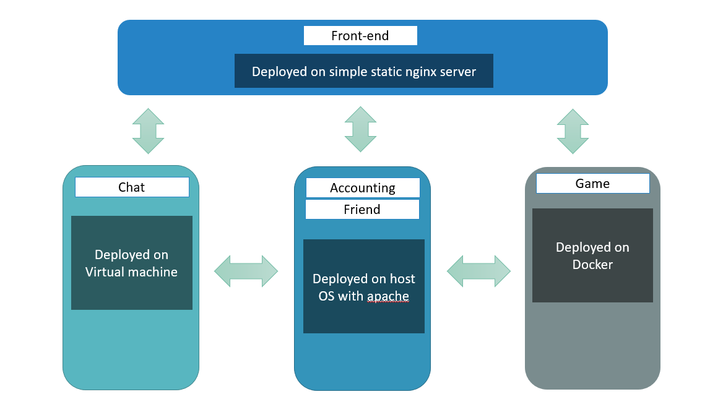

---------------------------------

#### UI

##### Login
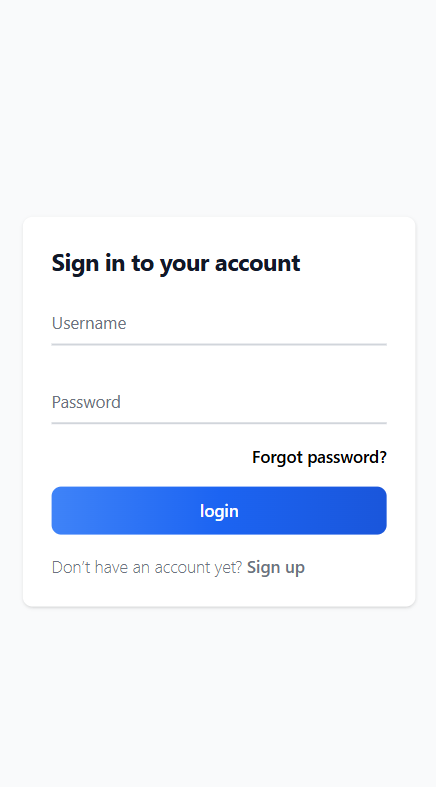

----

##### Sign up
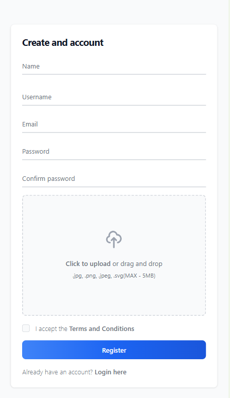

----


##### Finding people
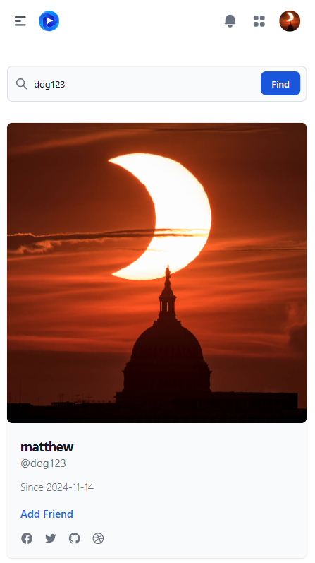

----


##### Friend request
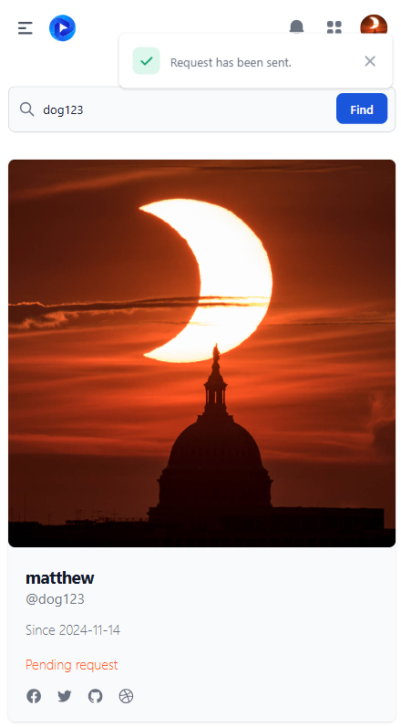

----


##### Accepting request


----

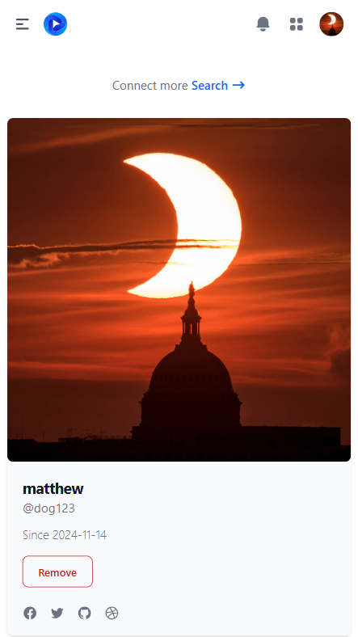

----
##### Chatting
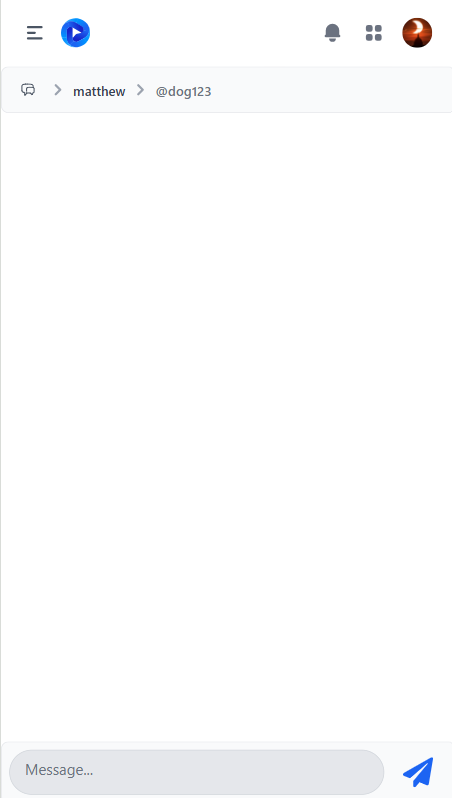

----

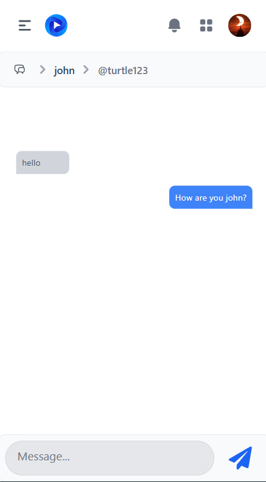

----

##### Game lobby

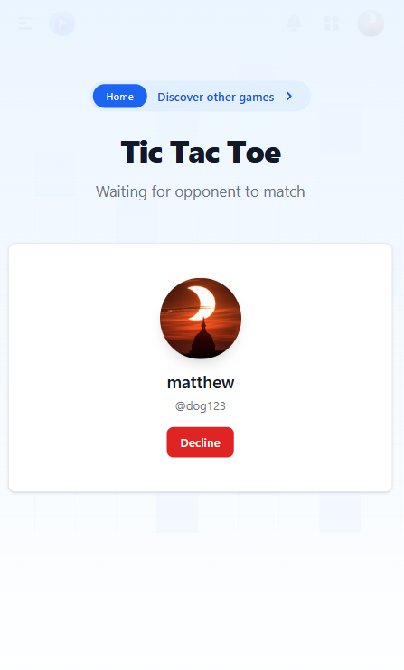

----

##### Accepting game request

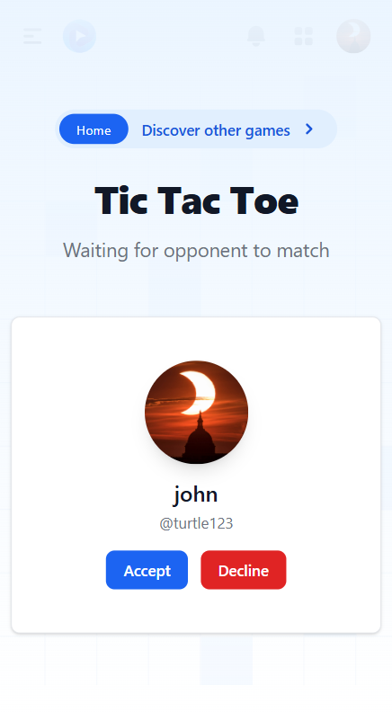

----

##### Game play

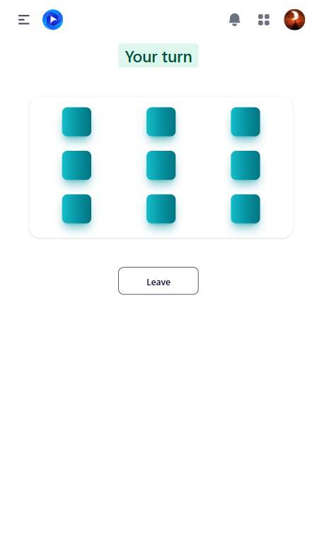

----

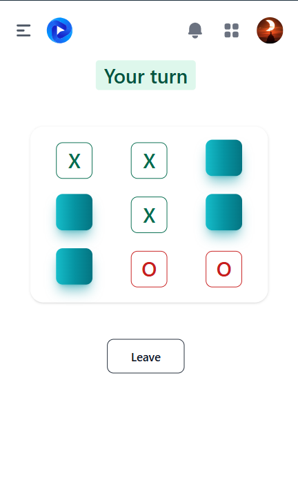

----

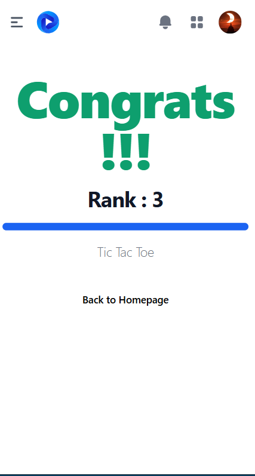

----

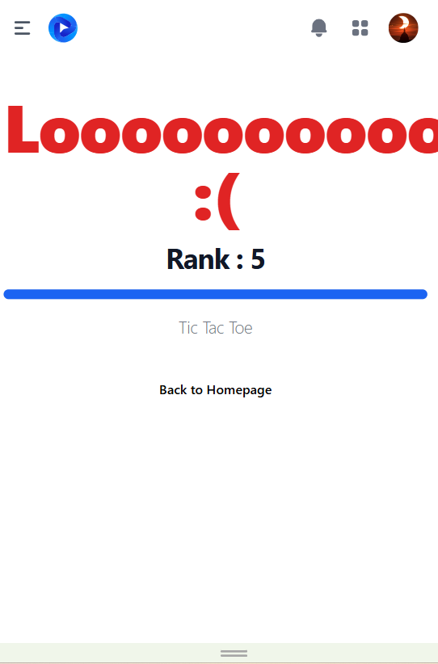

----

##### Game History

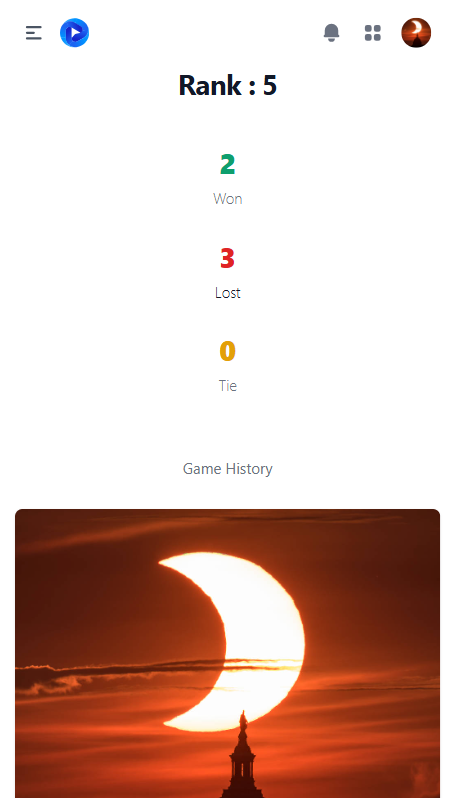